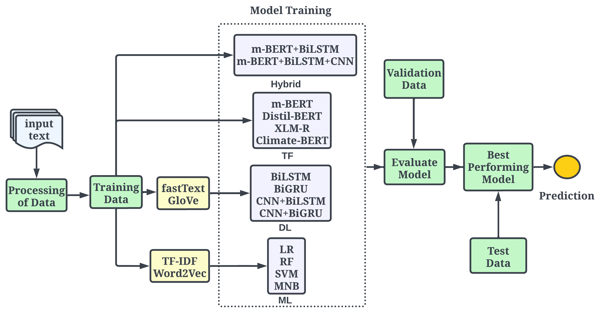

## CUET_Binary_Hackers at ClimateActivism 2024: A Comprehensive Evaluation and Superior Performance of Transformer-Based Models in Hate Speech Event Detection and Stance Classification for Climate Activism

**Author:** Salman Farsi, Asrarul Hoque Eusha, and Mohammad Shamsul Arefin

**Paper:** [Paper in ACL Anthology](https://aclanthology.org/2024.case-1.20/)

**Venue:** [CASE-2024](https://emw.ku.edu.tr/case-2024/)

## Abstract

The escalating impact of climate change on our environment and lives has spurred a global surge in climate change activism. However, the misuse of social media platforms like Twitter has opened the door to the spread of hatred against activism, targeting individuals, organizations, or entire communities. Also, the identification of the stance in a tweet holds paramount significance, especially in the context of understanding the success of activism. So, to address the challenge of detecting such hate tweets, identifying their targets, and classifying stances from tweets, this shared task introduced three sub-tasks, each aiming to address exactly one mentioned issue. We participated in all three sub-tasks and in this paper, we showed a comparative analysis between the different machine learning (ML), deep learning (DL), hybrid, and transformer models. Our approach involved proper hyper-parameter tuning of models and effectively handling class imbalance datasets through data oversampling. Notably, our fine-tuned m-BERT achieved a macro-average $f1$ score of 0.91 in sub-task A (Hate Speech Detection) and 0.74 in sub-task B (Target Identification). On the other hand, Climate-BERT achieved a $f1$ score of 0.67 in sub-task C. These scores positioned us at the forefront, securing 1st, 6th, and 15th ranks in the respective sub-tasks.

## Contribution

- We introduced and advocated for the utilization of BERT models by effectively handling the class imbalance data, leveraging their capabilities to classify textual content. 
- By delving into diverse methodologies, we seek to provide valuable insights that can inform the development of more robust systems for addressing the intricacies of climate activism events on social media platforms.

## Methodology

Figure 1 shows a schematic diagram of the methodology.




## Cite this work
If you find this repository helpful in your work please cite the following
```
@inproceedings{farsi-etal-2024-cuet,
    title = "{CUET}{\_}{B}inary{\_}{H}ackers at {C}limate{A}ctivism 2024: A Comprehensive Evaluation and Superior Performance of Transformer-Based Models in Hate Speech Event Detection and Stance Classification for Climate Activism",
    author = "Farsi, Salman  and
      Eusha, Asrarul Hoque  and
      Arefin, Mohammad Shamsul",
    editor = {H{\"u}rriyeto{\u{g}}lu, Ali  and
      Tanev, Hristo  and
      Thapa, Surendrabikram  and
      Uludo{\u{g}}an, G{\"o}k{\c{c}}e},
    booktitle = "Proceedings of the 7th Workshop on Challenges and Applications of Automated Extraction of Socio-political Events from Text (CASE 2024)",
    month = mar,
    year = "2024",
    address = "St. Julians, Malta",
    publisher = "Association for Computational Linguistics",
    url = "https://aclanthology.org/2024.case-1.20",
    pages = "145--155",
    abstract = "The escalating impact of climate change on our environment and lives has spurred a global surge in climate change activism. However, the misuse of social media platforms like Twitter has opened the door to the spread of hatred against activism, targeting individuals, organizations, or entire communities. Also, the identification of the stance in a tweet holds paramount significance, especially in the context of understanding the success of activism. So, to address the challenge of detecting such hate tweets, identifying their targets, and classifying stances from tweets, this shared task introduced three sub-tasks, each aiming to address exactly one mentioned issue. We participated in all three sub-tasks and in this paper, we showed a comparative analysis between the different machine learning (ML), deep learning (DL), hybrid, and transformer models. Our approach involved proper hyper-parameter tuning of models and effectively handling class imbalance datasets through data oversampling. Notably, our fine-tuned m-BERT achieved a macro-average {\$}f1{\$} score of 0.91 in sub-task A (Hate Speech Detection) and 0.74 in sub-task B (Target Identification). On the other hand, Climate-BERT achieved a {\$}f1{\$} score of 0.67 in sub-task C. These scores positioned us at the forefront, securing 1st, 6th, and 15th ranks in the respective sub-tasks. The detailed implementation information for the tasks is available in the GitHub.",
}


```
## Note
`If you find any anomaly or have any query/suggestion feel free to ping.`
